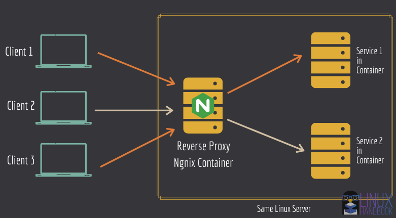

# Introduction

This simple application demonstrates how to use and deploy Nginx Reverse proxy in a docker container and use it to route traffic to other services internally (another container) and an external service. A reverse proxy server is a type of proxy server that typically sits behind the firewall in a private network and directs client requests to the appropriate backend server. 



*** Credits : https://linuxhandbook.com/nginx-reverse-proxy-docker/ ***

## Application components
This application has essentially 2 services - a web app & a nginx reverse proxy engine, which are both deployed as a container using docker compose. This start-up project demnstrates how to deploy these services as containers and how to configure the nginx reverse proxy

## Application structure
```
  |── docs                      # Contains edited nginx configuration file that will be copied to the image
  |    ├── img                  # Contains all images referenced in mkdocs
  |    ├── *.md                 # Other mkdocs .md files
  ├── mkdocs.yml                # YAML for for mkdocs
  ├── .gitattributes
  |  
  ├── default.conf              # Contains edited nginx configuration file that will be copied to the image
  |
  ├── Dockerfile                # Dockerfile for the web-app
  ├── Dockerfile.nginx          # Dockerfile for the nginx reverse-proxy
  |
  ├── docker-compose.yaml       # Defines docker-compose.yaml file for web-app & nginx-reverse-proxy
  |
  ├── helloworld.py             # Simple hello world python program using Flask API
  |
  ├── README.md                 # Standard README.md file
```
