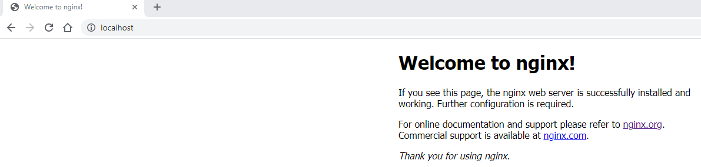
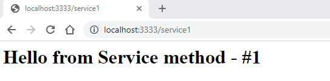

# Run the App 
We will now run and test the app

## Start the app 
Use command `docker compose up` to start the app from the project root directory. Note that 2 containers are created :

* nginx-docker-web-1
* nginx-docker-nginx-1

```
PS C:\Users\aniru\workspace\github\nginx-docker> docker compose up 
[+] Running 2/0
 - Container nginx-docker-web-1    Created                                                                                                                                                                       0.0s 
 - Container nginx-docker-nginx-1  Created                                                                                                                                                                       0.0s 
Attaching to nginx-docker-nginx-1, nginx-docker-web-1
nginx-docker-web-1    |  * Serving Flask app 'helloworld'
nginx-docker-web-1    |  * Debug mode: off
nginx-docker-web-1    | WARNING: This is a development server. Do not use it in a production deployment. Use a production WSGI server instead.
nginx-docker-web-1    |  * Running on all addresses (0.0.0.0)
nginx-docker-web-1    |  * Running on http://127.0.0.1:3333
nginx-docker-web-1    |  * Running on http://172.29.0.2:3333
nginx-docker-nginx-1  | 2023/01/12 16:12:04 [notice] 1#1: built by gcc 10.2.1 20210110 (Debian 10.2.1-6)
```
Now check the run-time status of the containers
```
PS C:\Users\aniru\workspace\github\nginx-docker> docker container ls 
CONTAINER ID   IMAGE                COMMAND                  CREATED        STATUS       PORTS                    NAMES
a4c0c31462c9   nginx-docker-nginx   "/docker-entrypoint.…"   29 hours ago   Up 2 hours   0.0.0.0:80->80/tcp       nginx-docker-nginx-1
368b5d540cc1   nginx-docker-web     "python ./helloworld…"   29 hours ago   Up 2 hours   0.0.0.0:3333->3333/tcp   nginx-docker-web-1
```

## Test the application
* Let's check the nginx localhost running on port 80 


* Also, let's check the web-app running on port 3333


* Now let's see if Nginx forwards our service1 request  


